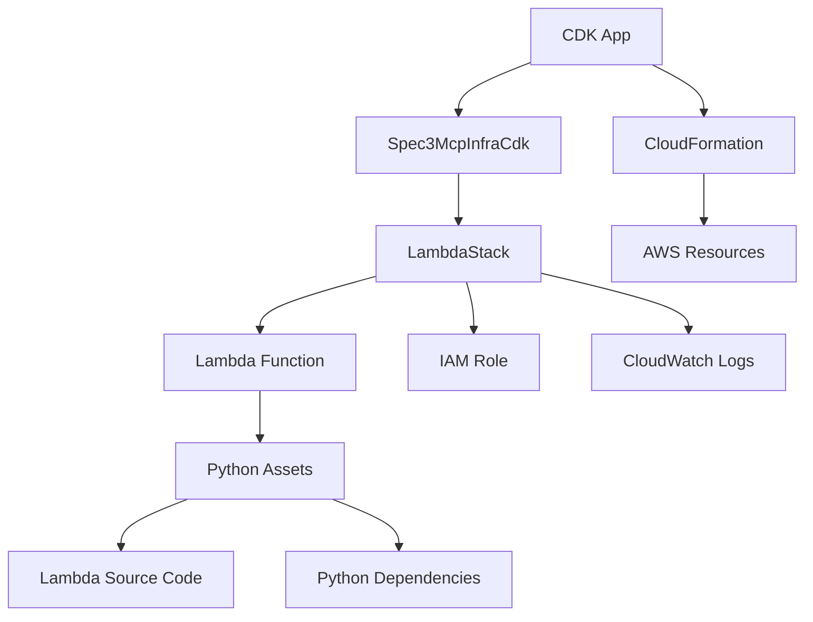

# System Patterns: Spec3 MCP Infrastructure CDK

## Architecture Overview



## Key Design Patterns

### 1. Stack Separation Pattern
- **Pattern**: Separate stacks for different resource types
- **Benefits**: Modular deployment, independent updates, clear boundaries
- **Implementation**: `LambdaStack` for Lambda resources, main stack for orchestration

### 2. Environment Configuration Pattern
- **Pattern**: Stage-based configuration through props
- **Benefits**: Environment isolation, consistent naming, easy management
- **Implementation**: `LambdaStackProps` with `stage` parameter

### 3. Asset Bundling Pattern
- **Pattern**: Docker-based bundling for Lambda deployment
- **Benefits**: Consistent builds, dependency isolation, platform compatibility
- **Implementation**: CDK asset bundling with pip install

### 4. Minimal Permissions Pattern
- **Pattern**: IAM roles with minimal required permissions
- **Benefits**: Security best practices, reduced attack surface
- **Implementation**: Basic execution role with CloudWatch Logs access

## CDK Construct Architecture

### Main Stack Structure
```typescript
export class Spec3McpInfraCdk extends Construct {
  constructor(scope: Construct, id: string, props?: cdk.StackProps) {
    super(scope, id);
    
    const lambdaStack = new LambdaStack(this, 'LambdaStack', {
      stage: 'dev' // Environment configuration
    });
  }
}
```

### Lambda Stack Structure
```typescript
export class LambdaStack extends cdk.Stack {
  constructor(scope: Construct, id: string, props: LambdaStackProps) {
    super(scope, id, props);
    
    // IAM Role Creation
    const lambdaExecutionRole = new iam.Role(...);
    
    // Lambda Function Creation
    const lambdaFunction = new lambda.Function(...);
  }
}
```

## Resource Dependencies

### Lambda Function Dependencies
```
LambdaStack
├── IAM Role (LambdaExecutionRole)
│   ├── Service Principal: lambda.amazonaws.com
│   ├── Managed Policy: AWSLambdaBasicExecutionRole
│   └── CloudWatch Logs Access
├── Lambda Function (PythonExampleFunction)
│   ├── Runtime: Python 3.11
│   ├── Handler: spec3_mcp_lambda.handlers.spec3_lambda.handler
│   ├── Code: Asset from Lambda workspace
│   ├── Role: LambdaExecutionRole
│   ├── Environment: STAGE variable
│   ├── Timeout: 30 seconds
│   └── Memory: 256MB
└── CloudWatch Logs (Automatic)
    ├── Log Group: /aws/lambda/PythonExampleFunction
    └── Retention: Default (never expire)
```

## Asset Bundling Process

### Bundling Configuration
```typescript
code: lambda.Code.fromAsset('/home/dhevb/workspaces/spec3-mcp-lambda', {
  bundling: {
    image: lambda.Runtime.PYTHON_3_11.bundlingImage,
    command: [
      '/bin/sh', '-c',
      'pip install -r requirements.txt -t /asset-output && cp -r src/* /asset-output/'
    ],
  },
})
```

### Bundling Steps
1. **Source Path**: Hard-coded path to Lambda workspace
2. **Docker Image**: Python 3.11 bundling image
3. **Dependencies**: `pip install -r requirements.txt -t /asset-output`
4. **Source Code**: `cp -r src/* /asset-output/`
5. **Output**: Bundled Lambda deployment package

## Environment Management Patterns

### Stage-based Configuration
- **Development**: `stage: 'dev'`
- **Staging**: `stage: 'staging'` (future)
- **Production**: `stage: 'prod'` (future)

### Resource Naming Strategy
- **Current**: Fixed construct IDs
- **Future**: Stage-prefixed resource names
- **Pattern**: `${stage}-${resource-type}-${identifier}`

### Environment Variables
- **STAGE**: Deployment environment identifier
- **Future**: Additional environment-specific variables

## Extension Patterns

### Adding New AWS Resources
1. Import required CDK modules
2. Create resource construct in appropriate stack
3. Configure resource properties and dependencies
4. Update environment configuration as needed

### Adding New Environments
1. Update stage configuration in main stack
2. Add environment-specific props interface
3. Configure environment-specific resource settings
4. Test deployment in new environment

### Adding New Lambda Functions
1. Create new Lambda function construct
2. Configure handler path and runtime
3. Set up IAM permissions and environment
4. Update asset bundling if needed

## Error Handling and Rollback

### Deployment Error Handling
- **CDK Validation**: Pre-deployment validation
- **CloudFormation Rollback**: Automatic rollback on failure
- **Resource Dependencies**: Proper dependency management
- **Error Messages**: Clear error reporting

### Monitoring and Observability
- **CloudWatch Logs**: Automatic log group creation
- **Lambda Metrics**: Built-in CloudWatch metrics
- **CDK Outputs**: Resource ARNs and identifiers
- **Deployment Status**: CloudFormation stack status
